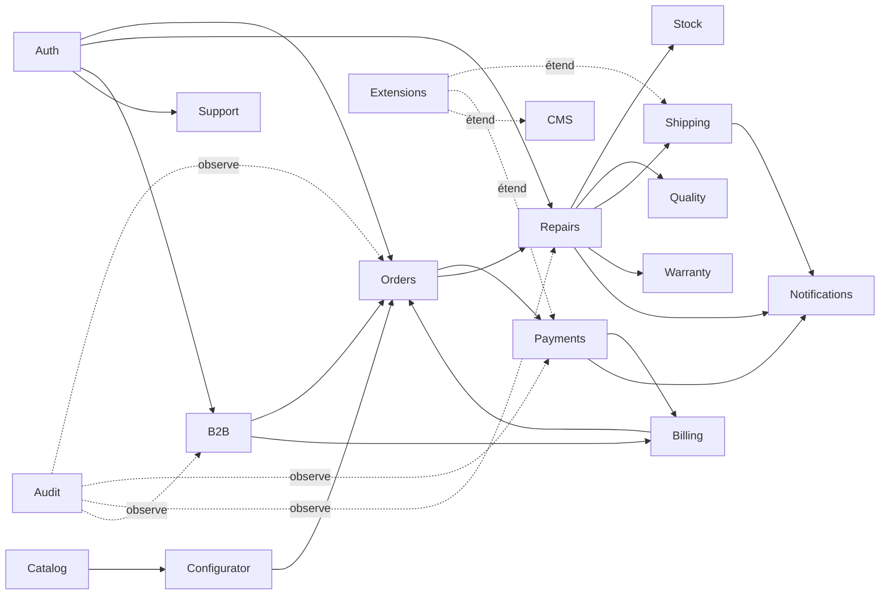
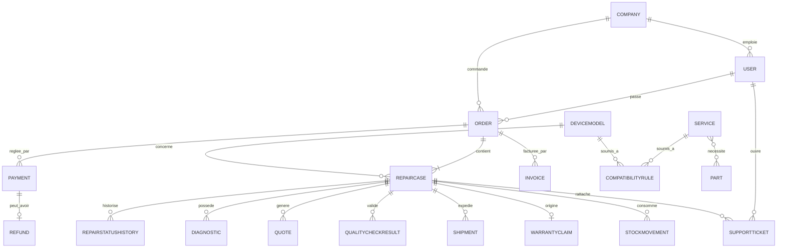

# SaveMyControllers — Document d'Architecture

## 1. Résumé exécutif

SaveMyControllers est une application métier modulaire destinée à la réparation, l'amélioration et la personnalisation de manettes de jeu, pour particuliers et professionnels. Le système couvre l'ensemble du cycle : configurateur de prestations, commande, paiement, logistique (aller/retour), atelier technique, contrôle qualité, garantie, facturation, portail professionnel, CMS et administration complète. L'architecture retenue est un **monolithe modulaire** en TypeScript strict, organisé en modules métier isolés, avec une séparation claire entre le cœur applicatif et un système d'extensions contrôlé. Cette approche privilégie la vitesse de mise en production, la maintenabilité et le coût, tout en gardant une trajectoire claire vers une extraction en microservices si le volume l'exige un jour.

Le document ci-dessous fixe les fondations techniques, fonctionnelles et organisationnelles du projet. Il sert de référence unique pour l'équipe de développement et pour toute décision future.

---

## 2. Hypothèses retenues

Ces hypothèses sont posées faute d'information commerciale ou technique explicite. Chacune est **configurable depuis l'administration**, sauf mention contraire.

| # | Hypothèse | Configurable ? |
|---|---|---|
| H1 | Devise par défaut : EUR, TVA française par défaut (20 %, taux réduits paramétrables) | Oui |
| H2 | Langue initiale : français, architecture i18n dès le départ (clé/valeur, pas de texte en dur) | Architecture fixe, contenu oui |
| H3 | Transporteurs initiaux : Mondial Relay, Colissimo, Chronopost, via abstraction | Oui (ajout par extension) |
| H4 | Paiement initial : Stripe (carte + Payment Intents), via abstraction PSP | Oui (ajout par extension) |
| H5 | Hébergement initial : cloud unique (OVH/Scaleway/AWS eu-west), conteneurs Docker | Infrastructure, pas admin |
| H6 | Marques initiales : Sony, Microsoft, Nintendo — non codées en dur, saisies en base | Oui |
| H7 | Garantie par défaut : 3 mois pièces et main d'œuvre, personnalisable par prestation/modèle | Oui |
| H8 | Délai de traitement par défaut : 5 à 10 jours ouvrés, personnalisable | Oui |
| H9 | Statut juridique vendeur : société française, mentions légales et CGV en CMS | Oui |
| H10 | Numérotation des factures conforme à la législation française (séquence continue, non modifiable a posteriori) | Format oui, logique non |
| H11 | RGPD applicable (hébergement et clients UE) | Non négociable |
| H12 | Volumétrie cible initiale : quelques centaines de dossiers/mois — ne justifie pas des microservices dès le MVP | — |
| H13 | Compte invité autorisé mais traçabilité complète exigée (email obligatoire) | Oui (activable/désactivable) |
| H14 | Les LED/éléments électroniques avancés dépendent du modèle ; le catalogue gère la compatibilité, pas de règle figée | Oui |

Toute hypothèse peut être révisée ; elle est signalée ici pour éviter les décisions implicites non tracées.

---

## 3. Choix de la stack avec justification

| Couche | Choix retenu | Justification |
|---|---|---|
| Langage | TypeScript strict partout (frontend, backend, scripts) | Un seul langage, typage partagé (DTOs), réduction des bugs d'intégration, meilleure maintenabilité à long terme |
| Monorepo | Turborepo + pnpm workspaces | Cache de build, exécution parallèle des tâches, partage de types/UI entre apps, coût d'outillage faible |
| Frontend public + client | Next.js (App Router), React | SSR/SSG pour le SEO (pages prestations, modèles, articles), performance, écosystème mature |
| Frontend admin/atelier | Next.js (routes séparées) ou app React dédiée dans le même monorepo | Réutilisation des composants, cohérence technique, un seul pipeline de déploiement |
| Backend | NestJS | Architecture modulaire native (proche du besoin métier), DI, guards/interceptors pour RBAC, testabilité, documentation OpenAPI automatique |
| API | REST documenté (OpenAPI/Swagger) | Simplicité, outillage large, contrats clairs pour intégrations tierces (extensions, pro) ; GraphQL non retenu au MVP (complexité non justifiée par le besoin) |
| Base de données | PostgreSQL | Intégrité relationnelle forte (commandes, stocks, facturation légale), transactions ACID indispensables en e-commerce |
| ORM | Prisma | Typage de bout en bout, migrations versionnées, lisibilité du schéma |
| Cache / files | Redis + BullMQ | Files de tâches (emails, PDF, webhooks), verrous, cache de configuration |
| Stockage fichiers | S3-compatible (photos, PDF, factures) avec URLs signées | Séparation du stockage privé/public, scalabilité, pas de fichiers sensibles servis directement |
| Génération PDF | Moteur headless (Chromium via Playwright, ou équivalent côté serveur) piloté par templates HTML | Fiabilité de rendu, cohérence avec le design système, facilité de maintenance des gabarits |
| Emails transactionnels | Fournisseur SMTP/API dédié (ex. Postmark/Brevo/SES), abstrait derrière une interface interne | Délivrabilité, templates, tracking des échecs |
| Paiement | Abstraction `PaymentProviderInterface`, implémentation initiale Stripe | Permet d'ajouter un second PSP sans réécrire le métier |
| Observabilité | Logs structurés + Sentry (erreurs) + métriques (Prometheus/Grafana ou équivalent managé) | Diagnostic rapide en production, SLA |
| Infrastructure | Docker + Docker Compose (dev), CI/CD (GitHub Actions), déploiement conteneurisé | Reproductibilité des environnements, portabilité |
| Secrets | Variables d'environnement + gestionnaire de secrets (Vault ou équivalent managé du cloud) | Aucune donnée sensible en dur dans le code |

**Justification du monolithe modulaire plutôt que microservices** : voir section 4.

---

## 4. Comparaison monolithe contre frontend/backend séparés

Précision de vocabulaire : la séparation **frontend / backend** est retenue dans les deux scénarios (Next.js consommant une API NestJS). La vraie question architecturale est **monolithe modulaire vs microservices**.

| Critère | Monolithe modulaire (retenu) | Microservices |
|---|---|---|
| Vitesse de mise en production | Élevée | Faible au départ (infra à construire) |
| Coût d'infrastructure | Faible à modéré | Élevé (orchestration, réseau, observabilité distribuée) |
| Complexité opérationnelle | Faible à modérée | Élevée (déploiements multiples, cohérence transactionnelle distribuée) |
| Cohérence transactionnelle (commande/paiement/stock) | Native (transactions SQL) | Nécessite sagas/compensation, plus fragile |
| Équipe requise | Petite à moyenne équipe full-stack | Équipe plus large avec compétences DevOps dédiées |
| Évolutivité fonctionnelle | Bonne si les modules sont bien isolés dès le départ | Bonne mais sur-ingénierie si le volume ne le justifie pas |
| Scalabilité technique | Bonne jusqu'à un volume important (scaling horizontal du monolithe possible) | Meilleure à très grande échelle uniquement |
| Risque pour ce projet au stade actuel | Faible | Risque de sur-ingénierie, ralentit le MVP |

**Décision** : monolithe modulaire NestJS, avec des frontières de module strictes (un module ne doit jamais accéder directement aux tables d'un autre module hors de son service dédié). Cette discipline permet une extraction ultérieure en microservices si la volumétrie ou l'organisation l'exige, sans réécriture complète.

---

## 5. Architecture globale

```mermaid
flowchart TB
    subgraph Client["Applications front"]
        WEB[Site public + espace client\nNext.js]
        PRO[Portail professionnel\nNext.js]
        ADMIN[Back-office admin\nNext.js]
        ATELIER[Interface atelier\nNext.js PWA]
    end

    subgraph API["API NestJS (monolithe modulaire)"]
        AUTH[Module Auth/RBAC]
        CATALOG[Module Catalogue/Configurateur]
        ORDER[Module Commandes]
        REPAIR[Module Dossiers réparation]
        PAY[Module Paiement]
        SHIP[Module Expédition]
        STOCK[Module Stocks]
        QC[Module Qualité]
        WARRANTY[Module Garantie]
        CMS[Module CMS]
        EXT[Module Extensions]
        NOTIF[Module Notifications/Automatisations]
        BILLING[Module Facturation]
        SUPPORT[Module Support]
        AUDIT[Module Audit/Logs]
    end

    subgraph Data["Données & services"]
        PG[(PostgreSQL)]
        REDIS[(Redis)]
        QUEUE[BullMQ - Files de tâches]
        S3[(Stockage S3 - photos, PDF, factures)]
        MAIL[Service Email]
        PSP[Prestataire de paiement]
        CARRIER[Transporteurs]
    end

    WEB --> API
    PRO --> API
    ADMIN --> API
    ATELIER --> API
    API --> PG
    API --> REDIS
    API --> QUEUE
    API --> S3
    NOTIF --> MAIL
    PAY --> PSP
    SHIP --> CARRIER
    PSP -. webhook .-> PAY
    CARRIER -. webhook .-> SHIP
```



---

## 6. Diagramme textuel des composants

```
[Navigateur / Mobile]
   |
   v
[CDN / Reverse proxy (TLS, rate limiting)]
   |
   v
[Next.js — App publique/client] [Next.js — Portail pro] [Next.js — Admin] [Next.js — Atelier PWA]
   |___________________________________|______________________|_________________|
                                        |
                                        v
                          [API NestJS — Gateway HTTP unique]
                                        |
        ------------------------------------------------------------
        |         |          |         |         |         |       |
     [Auth]   [Catalogue] [Commandes] [Réparation] [Paiement] [Expédition] [Stocks]
        |         |          |         |         |         |       |
        ------------------------------------------------------------
                                        |
                          [Couche persistance Prisma]
                                        |
                                   [PostgreSQL]

[BullMQ / Redis] <--- déclenché par événements métier (paiement validé, colis reçu, etc.)
   |
   v
[Workers] --> génération PDF, envoi email, appels transporteur, webhooks PSP

[S3] <--- photos dossiers, PDF bordereaux, factures, pièces jointes support
```

---

## 7. Structure du monorepo

```
savemycontrollers/
├── apps/
│   ├── web/                 # Next.js - site public + espace client
│   ├── pro/                 # Next.js - portail professionnel
│   ├── admin/                # Next.js - back-office
│   ├── atelier/               # Next.js PWA - interface technicien
│   └── api/                   # NestJS - API principale
├── packages/
│   ├── ui/                    # Design system partagé (composants React)
│   ├── config/                # ESLint, TSConfig, Prettier partagés
│   ├── types/                  # DTOs et types partagés front/back
│   ├── sdk/                   # Client API typé généré depuis OpenAPI
│   ├── i18n/                   # Dictionnaires de traduction
│   └── utils/                  # Fonctions utilitaires partagées
├── modules-backend/            # Modules métier NestJS (référencés par apps/api)
│   ├── auth/
│   ├── catalog/
│   ├── configurator/
│   ├── orders/
│   ├── repairs/
│   ├── payments/
│   ├── shipping/
│   ├── stock/
│   ├── quality/
│   ├── warranty/
│   ├── cms/
│   ├── extensions/
│   ├── notifications/
│   ├── billing/
│   ├── support/
│   └── audit/
├── extensions/                  # Extensions installées (isolées, voir section 22)
├── prisma/
│   ├── schema.prisma
│   └── migrations/
├── infra/
│   ├── docker/
│   ├── docker-compose.dev.yml
│   └── ci/
├── tests/
│   ├── e2e/
│   └── fixtures/
├── docs/
│   └── architecture/           # Ce document et ses évolutions
├── turbo.json
├── pnpm-workspace.yaml
└── package.json
```

---

## 8. Liste complète des modules

| Module | Responsabilité |
|---|---|
| Auth/RBAC | Authentification, sessions, MFA, rôles, permissions |
| Catalogue | Marques, familles, modèles, variantes, révisions, prestations, pièces, packs |
| Configurateur | Règles de compatibilité, calcul de prix/délai en temps réel |
| Commandes (Orders) | Panier, commande multi-appareils, statuts globaux |
| Dossiers de réparation (Repairs) | Cycle de vie par appareil, diagnostic, technicien, historique |
| Paiement (Payments) | Abstraction PSP, transactions, remboursements, webhooks |
| Facturation (Billing) | Factures, avoirs, devis, numérotation légale, TVA |
| Expédition (Shipping) | Abstraction transporteurs, étiquettes, suivi aller/retour |
| Stocks (Stock) | Pièces, mouvements, réservations, alertes, coûts, marges |
| Qualité (Quality) | Checklists de contrôle qualité par prestation/modèle |
| Garantie (Warranty) | Règles de garantie, demandes SAV, rattachement dossier |
| Professionnel (B2B) | Comptes entreprise, grilles tarifaires, commandes groupées |
| CMS | Pages, blocs, articles, FAQ, SEO, menus |
| Support | Tickets, messagerie client, pièces jointes |
| Notifications/Automatisations | Emails, règles déclenchées par événements métier |
| Extensions | Cycle de vie des extensions (installation, activation, rollback) |
| Audit/Logs | Journalisation des opérations sensibles, traçabilité RGPD |
| Administration (Settings) | Paramètres globaux, taxes, devises, textes configurables |
| Statistiques (Analytics) | Tableaux de bord, exports, indicateurs de rentabilité |

---

## 9. Dépendances entre les modules



Règle de conception stricte : un module ne manipule jamais directement les tables d'un autre module ; il passe systématiquement par le service public exposé de ce module. Cela garantit une frontière claire, testable, et extractible.

---

## 10. Entités principales de la base de données

| Entité | Description |
|---|---|
| User | Compte utilisateur (client, pro, staff) |
| Role / Permission | RBAC granulaire |
| Company | Entreprise cliente (portail pro) |
| Address | Adresses de facturation/livraison |
| Brand / ProductFamily / DeviceModel / DeviceVariant / HardwareRevision | Catalogue matériel hiérarchique |
| Service (Prestation) | Réparation, amélioration, customisation, modification clic souris, palettes |
| ServicePack | Regroupement de prestations |
| CompatibilityRule | Règle de compatibilité/incompatibilité modèle-prestation-pièce |
| PricingRule | Tarifs standards, particuliers, professionnels, remises quantitatives |
| Part (Pièce) | Référence, fournisseur, coût, stock |
| StockMovement | Mouvement de stock (entrée, sortie, réservation, correction) |
| Cart / CartItem | Panier en cours de configuration |
| Order | Commande (peut contenir plusieurs appareils) |
| RepairCase (Dossier) | Dossier de réparation par appareil, avec QR code |
| RepairStatusHistory | Historique des statuts d'un dossier |
| Diagnostic | Diagnostic déclaré/réel |
| Quote (Devis) | Devis initial ou complémentaire |
| Payment | Transaction de paiement |
| Refund | Remboursement |
| Invoice / CreditNote | Facture, avoir |
| Shipment | Expédition (aller/retour), transporteur, suivi |
| WarrantyClaim | Demande de garantie |
| QualityChecklist / QualityCheckResult | Contrôle qualité configurable |
| SupportTicket / TicketMessage | Support client |
| CmsPage / CmsBlock / CmsMenu | Contenu géré sans code |
| EmailTemplate / EmailLog | Emails transactionnels |
| Automation / AutomationRule | Règles d'automatisation métier |
| Extension / ExtensionInstallation | Extensions installées, versionnées |
| AuditLog | Journal d'audit des actions sensibles |
| Setting | Paramètres globaux configurables |

---

## 11. Relations principales entre les entités



---

## 12. Stratégie de gestion des commandes

- Une commande (`Order`) peut regrouper **plusieurs appareils**, chacun donnant lieu à un `RepairCase` indépendant avec son propre cycle de vie.
- Le statut de la commande est dérivé de manière contrôlée à partir des statuts de ses dossiers (jamais l'inverse), mais reste un champ propre pour permettre des statuts globaux (paiement, facturation).
- Le panier est persistant (associé à l'utilisateur ou à une session invité) pour éviter la perte de configuration.
- Une commande passe par des points de contrôle obligatoires : validation du configurateur → paiement (ou devis) → génération des documents → notification client.
- Toute modification de commande après paiement est tracée (audit) et déclenche, si nécessaire, un nouveau calcul financier (avoir, complément).
- Les commandes invité sont liées a posteriori à un compte si le client s'inscrit avec le même email (rapprochement contrôlé, jamais automatique et silencieux).

---

## 13. Stratégie de gestion des dossiers de réparation

- Chaque `RepairCase` possède un identifiant technique (UUID) et une **référence lisible** (ex. `SMC-2026-000123`), un QR code généré à la création, et un code-barres optionnel.
- La machine à états des statuts (section fonctionnelle 7) est implémentée comme une **table configurable** (`RepairStatus`) avec transitions autorisées définies en base, pas en dur dans le code : l'admin peut ajouter/réordonner des statuts, mais les transitions critiques (paiement, clôture) restent protégées par des règles système non désactivables.
- Chaque changement de statut est journalisé (`RepairStatusHistory`) avec auteur, date, commentaire optionnel.
- Les notes internes (techniciens) et les messages client sont deux flux strictement séparés (champ `visibility: internal | client`), pour ne jamais exposer une information sensible.
- La clôture d'un dossier est bloquée tant que la checklist qualité obligatoire n'est pas validée (section 15/20).

---

## 14. Stratégie du configurateur

- Le configurateur est un moteur de règles piloté par données, jamais par du code spécifique à un modèle.
- Entités clés : `CompatibilityRule` (compatible/incompatible/obligatoire/dépendant), `PricingRule` (prix de base, suppléments, remises), `StockAvailability`.
- Calcul de prix en temps réel côté serveur (source de vérité), le frontend n'affiche qu'un résultat retourné par l'API — **aucun calcul de prix ne doit être fait uniquement côté client** pour éviter toute manipulation.
- Le moteur applique dans l'ordre : sélection modèle → filtrage des prestations compatibles → application des règles de dépendance/incompatibilité → calcul du prix (règles standard, pro, remises quantitatives, packs) → estimation du délai (basée sur charge atelier + disponibilité stock).
- Architecture prévue pour accueillir plus tard une représentation visuelle interactive (ex. superposition de calques SVG/3D par pièce) sans revoir le moteur de règles : le rendu visuel consomme la même API de configuration.

---

## 15. Stratégie de compatibilité des options

- Table `CompatibilityRule` reliant `Service`/`Part` à `DeviceModel`/`DeviceVariant`/`HardwareRevision`, avec type de règle : `REQUIRES`, `EXCLUDES`, `RECOMMENDS`, `LIMITED_TO_REVISION`.
- Les incompatibilités sont **bloquantes** (empêchent l'ajout au panier) ; les recommandations sont **informatives** (bandeau UI, non bloquant).
- Les règles par révision matérielle permettent de gérer les cas où une même référence commerciale a plusieurs générations internes incompatibles avec certaines pièces (ex. joystick Hall Effect non compatible avec une ancienne carte mère).
- Validation systématique côté serveur à l'ajout au panier ET à la validation finale de commande (double contrôle contre les états obsolètes).

---

## 16. Stratégie des tarifs particuliers et professionnels

- `PricingRule` supporte plusieurs niveaux : tarif public, tarif professionnel par défaut, tarif négocié par entreprise (`CompanyPricingOverride`), remises quantitatives par palier.
- Priorité de résolution : tarif négocié entreprise > tarif professionnel par défaut > tarif public, avec remise quantitative appliquée en dernier.
- Historisation des tarifs (versionnement) pour garantir que le prix affiché sur une commande passée reste traçable même si les tarifs évoluent ensuite.
- Les remises et packs sont cumulables ou non selon une règle explicite configurable (`isCumulative`), pour éviter les combinaisons non désirées.

---

## 17. Stratégie de paiement

- Interface `PaymentProviderInterface` (create intent, capture, refund, handle webhook) implémentée par un adaptateur Stripe au MVP.
- Idempotence stricte : chaque tentative de paiement porte une clé d'idempotence, chaque webhook est vérifié en signature et dédupliqué par identifiant d'événement stocké.
- Modèle hybride : paiement immédiat si prix ferme ; sinon création d'un devis nécessitant validation client explicite avant tout paiement.
- Tout supplément (devis complémentaire) génère un nouveau paiement distinct, rattaché au dossier, jamais une modification silencieuse du paiement initial.
- Remboursement total ou partiel journalisé (`Refund`), rapproché du paiement d'origine, avec motif obligatoire.
- Paiement différé réservé aux comptes professionnels approuvés avec conditions configurables (délai, plafond d'encours).

---

## 18. Stratégie d'expédition

- Interface `CarrierProviderInterface` (créer étiquette, suivre colis, points relais) avec adaptateurs Mondial Relay, Colissimo, Chronopost au MVP.
- Frais aller/retour configurables par transporteur, zone, poids/gabarit.
- Suivi bidirectionnel : colis entrant (client → atelier) et colis retour (atelier → client), chacun avec son propre `Shipment` et numéro de suivi.
- Relances automatiques configurables si un client ne confie pas son colis dans le délai imparti (déclenchées par le moteur d'automatisation, section 20).
- Webhooks transporteur mis à jour en asynchrone via file de tâches, avec réconciliation manuelle possible depuis l'admin en cas d'échec.

---

## 19. Stratégie de génération des PDF et QR codes

- Génération asynchrone (worker dédié) déclenchée par événement métier (paiement validé, réparation terminée) pour ne jamais bloquer une requête utilisateur.
- Gabarits HTML versionnés (par type de document : confirmation, fiche à glisser dans le colis, facture, avoir, devis), rendus via moteur headless, stockés en S3 privé.
- QR code encodant une URL signée à durée limitée pointant vers le dossier (scannable par l'atelier, sans authentification complète mais avec contrôle d'accès contextuel).
- Toute génération de document légal (facture, avoir) est immuable une fois créée ; une correction donne lieu à un nouveau document (avoir), jamais à une édition rétroactive.

---

## 20. Stratégie de gestion des stocks

- Une prestation référence une liste de `Part` consommées automatiquement (`ServicePartConsumption`), avec quantité par défaut, ajustable par le technicien au moment du diagnostic réel.
- Mouvements de stock tracés (`StockMovement`) : réception, réservation à la validation du devis, consommation à la clôture, retour, correction d'inventaire.
- Alertes de stock minimum configurables par pièce, remontées au tableau de bord admin et par notification.
- Calcul automatique du coût matière par dossier, permettant le calcul de marge par réparation, par prestation, et par client professionnel (module statistiques).

---

## 21. Stratégie du CMS

- Éditeur par blocs prédéfinis (texte riche encadré, image, FAQ, témoignage, bannière, formulaire) — **pas d'injection de HTML/JS arbitraire** pour éviter tout risque XSS.
- Contenu structuré en base (pas de fichiers statiques édités à la main), avec brouillon, prévisualisation, planification de publication, historique de versions et restauration.
- SEO géré par page : titre, meta description, URL personnalisée, redirections, données structurées (JSON-LD) générées à partir de champs structurés (pas de saisie libre de script).
- Pages dynamiques générées automatiquement pour chaque prestation et chaque modèle (SEO programmatique), avec possibilité de surcharge manuelle du contenu.

---

## 22. Stratégie du système d'extensions

Principe directeur : **aucune exécution arbitraire de code non contrôlé**. L'extensibilité passe par des points d'extension définis (hooks, interfaces), pas par un chargement dynamique de code tiers non audité en production.

**Modèle retenu — deux niveaux :**

1. **Modules internes** : versionnés avec le monorepo, revus en code review classique, déployés avec l'application.
2. **Extensions installables** : packages respectant un manifeste strict, chargés uniquement après **revue et publication par l'équipe SaveMyControllers** (pas d'upload arbitraire exécuté à chaud par un client final). Le super-administrateur peut activer/configurer/désactiver une extension déjà validée, pas injecter du code non vérifié en production.

**Manifeste d'extension (exemple de structure) :**

```json
{
  "id": "carrier-dpd",
  "name": "Transporteur DPD",
  "version": "1.2.0",
  "author": "SaveMyControllers",
  "compatibility": ">=2.0.0 <3.0.0",
  "permissions": ["shipping.write", "settings.read"],
  "hooks": ["shipment.create", "shipment.track"],
  "migrations": ["001_init_dpd_config.sql"],
  "signature": "sha256:..."
}
```

**Cycle de vie contrôlé :**

| Étape | Contrôle |
|---|---|
| Import ZIP | Vérification de signature cryptographique et d'intégrité |
| Vérification de structure | Validation du manifeste contre un schéma strict |
| Vérification de compatibilité | Version du cœur applicatif compatible |
| Validation des permissions | Liste blanche de permissions, jamais d'accès système large |
| Sauvegarde préalable | Snapshot base + configuration avant installation |
| Exécution | Code exécuté dans le même processus mais **isolé fonctionnellement** par les interfaces définies (pas d'accès direct à la base hors du service exposé), avec possibilité future d'isolation renforcée (sandbox process séparé pour les extensions non éditées en interne) |
| Activation/désactivation | Réversible, sans perte de données |
| Mise à jour | Migration versionnée, testée en préproduction avant prod |
| Rollback | Restauration automatique en cas d'échec de migration |
| Journal | Toute action d'installation/désinstallation/mise à jour journalisée dans l'audit log |
| Accès | Réservé strictement au rôle super-administrateur |

Ce modèle évite le risque d'exécution de code arbitraire tout en offrant une vraie modularité pour les transporteurs, moyens de paiement, blocs CMS et automatisations.

---

## 23. Stratégie des rôles et permissions

- RBAC granulaire : `Role` → ensemble de `Permission` (format `ressource:action`, ex. `order:refund`, `extension:install`, `margin:view`).
- Rôles initiaux : super-administrateur, administrateur, responsable atelier, technicien, support client, commercial, comptable, préparateur de commandes, partenaire professionnel — **modifiables et étendables depuis l'admin** (création de rôles personnalisés).
- Les permissions sensibles (remboursement, installation d'extension, modification des paramètres système, consultation des marges, consultation de données personnelles) sont marquées `sensitive: true` et systématiquement journalisées.
- Vérification des permissions côté serveur exclusivement (guards NestJS) ; le frontend adapte l'affichage mais ne constitue jamais la seule barrière de sécurité.

---

## 24. Stratégie de sécurité

- Authentification : hachage Argon2id, politique de mot de passe configurable, verrouillage temporaire après tentatives échouées, alertes de connexion suspecte.
- MFA obligatoire pour les rôles administratifs (TOTP), optionnelle pour les clients.
- Sessions : tokens courts + refresh token rotatif, révocation possible depuis l'admin.
- Protections : CSRF (double soumission de token), CSP stricte, échappement systématique côté rendu (XSS), requêtes paramétrées via ORM (SQL injection), validation stricte de tous les DTOs en entrée (class-validator).
- Fichiers : validation du type MIME réel (pas seulement extension), limite de taille, stockage privé S3, accès uniquement via URL signée à durée limitée.
- Rate limiting par IP/utilisateur sur les endpoints sensibles (login, paiement, upload).
- Secrets exclusivement en variables d'environnement/gestionnaire de secrets, jamais en dur dans le code ni en base non chiffrée.
- Sauvegardes automatiques chiffrées, procédure de restauration testée régulièrement.
- RGPD : consentement tracé, export des données personnelles à la demande, suppression/anonymisation, politique de conservation configurable par type de donnée.

---

## 25. Stratégie de journalisation et d'audit

- `AuditLog` : acteur, action, ressource, valeurs avant/après (pour les champs sensibles), horodatage, adresse IP, résultat (succès/échec).
- Couvre au minimum : connexions admin, changements de permissions, remboursements, installation/désinstallation d'extension, modification des paramètres système, export de données personnelles, suppression de compte.
- Logs applicatifs structurés (JSON) séparés des logs d'audit métier, envoyés vers un système centralisé (ex. stack ELK ou équivalent managé) avec rétention configurable.
- Accès en lecture au journal d'audit restreint aux rôles autorisés, journal lui-même non modifiable (append-only).

---

## 26. Stratégie de tests

| Type | Portée |
|---|---|
| Tests unitaires | Logique métier pure (calcul de prix, machine à états, règles de compatibilité) |
| Tests d'intégration | Modules NestJS avec base de test (transactions, contraintes) |
| Tests API | Contrats OpenAPI, codes de retour, validations |
| Tests de permissions | Matrice rôle × action pour chaque endpoint sensible |
| Tests de paiement | Simulation PSP en mode test, scénarios d'échec, remboursement |
| Tests de webhooks | Rejeu, idempotence, signatures invalides |
| Tests du configurateur | Combinatoires de compatibilité/incompatibilité, calcul de prix |
| Tests de compatibilité | Règles par modèle/révision |
| Tests du parcours de commande | Du panier à la confirmation, y compris invité |
| Tests end-to-end | Parcours critiques (Playwright) : commande, paiement, suivi, support |
| Tests d'accessibilité | Vérification WCAG AA sur les parcours principaux |
| Tests de sécurité | Scans automatisés (dépendances, OWASP), tests d'intrusion périodiques |
| Analyse statique / lint | ESLint strict, typage TypeScript strict, formatage Prettier |
| Migrations testées | Application/rollback sur base de test avant chaque déploiement |
| Données de démonstration | Jeu de données réaliste anonymisé pour recette et formation |

---

## 27. Stratégie de déploiement

- Quatre environnements : **développement** (local, Docker Compose), **test/CI** (éphémère, exécuté à chaque pull request), **préproduction** (miroir de production, recette fonctionnelle), **production**.
- CI/CD : build, lint, tests, scan de sécurité des dépendances, build d'images Docker, déploiement automatique en préproduction, déploiement en production après validation manuelle (ou automatique selon politique choisie plus tard).
- Migrations de base appliquées de façon contrôlée et réversible, jamais directement en production sans passage préalable en préproduction.
- Feature flags pour activer progressivement des fonctionnalités sensibles (ex. nouveau transporteur) sans redéploiement complet.
- Stratégie de rollback : images versionnées, capacité de revenir à la version précédente rapidement.

---

## 28. Liste des risques techniques

| Risque | Impact | Mitigation |
|---|---|---|
| Complexité du moteur de compatibilité (combinatoire modèle/prestation/pièce) | Bugs de configuration, prix erronés | Modélisation rigoureuse dès le MVP, tests combinatoires automatisés |
| Cohérence stock/réservation en cas de forte charge | Survente de pièces | Transactions SQL strictes, réservation atomique |
| Dérive de sécurité liée aux extensions | Compromission | Modèle d'extensions contrôlé (section 22), pas d'exécution arbitraire |
| Génération PDF/QR sous charge | Latence, échecs silencieux | Traitement asynchrone, retries, alerting |
| Webhooks PSP/transporteur non fiables | Statuts désynchronisés | Idempotence, réconciliation manuelle possible |
| Croissance du monolithe | Difficulté de maintenance à terme | Discipline de frontières de modules dès le départ (section 9) |
| Conformité RGPD incomplète | Risque juridique | Intégration dès le MVP, pas en rattrapage |
| Numérotation légale des factures | Risque fiscal si mal implémentée | Séquence atomique en base, immuabilité des documents émis |

---

## 29. Plan de développement par phases

| Phase | Contenu |
|---|---|
| Phase 0 | Socle technique : monorepo, CI/CD, environnements, authentification, RBAC de base |
| Phase 1 | Catalogue + configurateur (marques, modèles, prestations, règles de compatibilité, calcul de prix) |
| Phase 2 | Panier, commande, paiement (Stripe), génération PDF/QR, emails transactionnels de base |
| Phase 3 | Dossiers de réparation, statuts, interface atelier (scan, diagnostic, notes, devis complémentaire) |
| Phase 4 | Expédition (transporteurs), suivi colis aller/retour |
| Phase 5 | Stocks et consommation de pièces, calcul de marge |
| Phase 6 | Contrôle qualité configurable, garantie/SAV |
| Phase 7 | Espace client complet (suivi, factures, garanties, support) |
| Phase 8 | Portail professionnel (comptes, tarifs négociés, commandes groupées) |
| Phase 9 | CMS complet, SEO programmatique |
| Phase 10 | Administration avancée (tableaux de bord, automatisations, exports) |
| Phase 11 | Système d'extensions et premières extensions (transporteur additionnel, moyen de paiement additionnel) |
| Phase 12 | Durcissement sécurité, audit RGPD complet, tests de charge, mise en production |

---

## 30. Définition précise du MVP

Le MVP couvre le parcours complet mais avec un périmètre fonctionnel réduit et honnête (aucune fonctionnalité simulée) :

- Catalogue : marques/modèles/prestations réels, saisis en admin (pas de données fictives en dur).
- Configurateur : sélection modèle, prestations, calcul de prix et délai en temps réel, gestion des incompatibilités.
- Commande et paiement immédiat (Stripe) pour prestations à prix fixe ; devis manuel simple pour les cas complexes (sans workflow avancé de négociation).
- Génération automatique de la confirmation, de la fiche à glisser dans le colis et du QR code.
- Suivi manuel des dossiers de réparation avec statuts configurables et interface atelier basique (recherche, mise à jour de statut, notes, photos).
- Espace client : suivi de commande, téléchargement des documents, contact support basique.
- Administration : gestion du catalogue, des commandes, des dossiers, des paramètres essentiels (taxes, transporteurs de base, textes CMS essentiels).
- Un seul transporteur et un seul PSP actifs, mais **implémentés derrière l'abstraction définitive** (pas de code jetable).
- CMS minimal (pages statiques essentielles : accueil, mentions légales, CGV, contact).

Explicitement hors MVP (et signalé comme tel, pas simplifié silencieusement) : portail professionnel complet, système d'extensions opérationnel, automatisations avancées, contrôle qualité configurable multi-critères, garantie en libre-service, statistiques de rentabilité avancées, multilingue actif (architecture prête, contenu non traduit).

---

## 31. Fonctionnalités prévues après le MVP

- Portail professionnel complet (grilles tarifaires, commandes groupées, import CSV, paiement différé).
- Système d'extensions opérationnel avec premières extensions officielles.
- Moteur d'automatisations configurable (règles déclenchées par événements).
- Contrôle qualité configurable par prestation/modèle avec blocage de clôture.
- Garantie en libre-service complète (demande, rattachement, nouveau dossier).
- Statistiques de rentabilité avancées (marge par prestation/client/technicien).
- Multilingue actif (contenu traduit, sélection de langue).
- Représentation visuelle avancée du configurateur (aperçu graphique des personnalisations).
- Application mobile dédiée atelier (au-delà de la PWA).

---

## 32. Critères d'acceptation de la première version

- Un client peut réaliser entièrement le parcours : configurateur → panier → paiement → confirmation → suivi → réception des documents, sans intervention manuelle.
- Un technicien peut scanner un dossier, mettre à jour son statut, ajouter des notes et photos, et ces informations sont visibles côté client en temps réel selon leur visibilité.
- Un administrateur peut modifier une prestation, un prix, un texte CMS, sans intervention du développeur.
- Aucune donnée sensible n'est présente en dur dans le code ; tous les secrets proviennent de variables d'environnement.
- Toutes les actions sensibles listées en section 25 sont journalisées et consultables.
- Les tests automatisés (unitaires, intégration, e2e sur le parcours critique) passent en CI avant tout déploiement.
- Le site est intégralement responsive et testé sur mobile, tablette, desktop.

---

## 33. Liste des paramètres configurables dans l'administration

- Taxes (taux de TVA par catégorie), devise.
- Transporteurs actifs, frais aller/retour, délais.
- Moyens de paiement actifs, conditions de paiement pro.
- Statuts de dossier et leurs libellés/ordre (hors transitions système protégées).
- Garanties par prestation/modèle (durée, exclusions).
- Délais de traitement par défaut et par prestation.
- Grilles tarifaires standard, pro, remises quantitatives.
- Textes légaux, CGV, mentions, pages CMS, FAQ.
- Modèles d'emails et variables dynamiques.
- Règles d'automatisation (déclencheurs et actions).
- Checklists de contrôle qualité par prestation/modèle.
- Rôles personnalisés et permissions associées.
- Paramètres SEO globaux (métadonnées par défaut, redirections).
- Seuils d'alerte de stock.
- Paramètres de sécurité (politique de mot de passe, durée de session, MFA obligatoire ou non par rôle).

---

## 34. Liste des décisions irréversibles ou coûteuses à changer

- Choix de PostgreSQL comme base relationnelle principale (migration ultérieure très coûteuse).
- Modèle de données du catalogue (marque/famille/modèle/variante/révision) : structure fondatrice du configurateur.
- Format de numérotation légale des factures (contrainte réglementaire, changement rétroactif interdit).
- Architecture monolithe modulaire au démarrage (une extraction ultérieure en microservices est possible mais coûteuse si les frontières de modules n'ont pas été respectées dès le départ).
- Modèle de permissions RBAC (une refonte impacte tous les modules).
- Format du manifeste d'extension (rétrocompatibilité à assurer pour toute extension déjà publiée).
- Choix du PSP principal comme intégration de référence (changement possible via l'abstraction, mais migration des données de paiement historiques sensible).

---

## 35. Première proposition d'arborescence des pages publiques

```
/
/reparation
/reparation/[marque]/[modele]
/customisation
/customisation/[marque]/[modele]
/modifications-clic-souris
/palettes-arriere
/configurateur
/configurateur/[marque]/[modele]
/professionnels
/professionnels/tarifs
/a-propos
/garantie
/faq
/blog
/blog/[article]
/contact
/mentions-legales
/cgv
/politique-confidentialite
/connexion
/inscription
/compte
/compte/commandes
/compte/commandes/[reference]
/compte/appareils
/compte/adresses
/compte/garanties
/compte/support
/compte/support/[ticket]
/compte/donnees-personnelles
```

---

## 36. Première proposition de navigation client

- Accueil → Réparation / Customisation / Modifications clic souris / Palettes → Configurateur.
- Menu compte : Mes commandes → Détail commande → Détail dossier de réparation → Documents.
- Notifications : bandeau de devis en attente de validation, alertes de statut.
- Support accessible depuis toutes les pages du compte (widget ou lien persistant).

---

## 37. Première proposition de navigation professionnelle

- Tableau de bord entreprise → Commandes groupées → Import CSV/Excel → Suivi individuel des appareils.
- Grille tarifaire personnalisée, historique de facturation consolidée.
- Gestion des utilisateurs internes et de leurs rôles.
- Interlocuteur commercial dédié (coordonnées affichées).

---

## 38. Première proposition de navigation administrative

- Tableau de bord (indicateurs clés, alertes).
- Catalogue (marques, modèles, prestations, pièces).
- Commandes / Dossiers de réparation (vue liste, filtres avancés, vue détail).
- Paiements / Facturation / Remboursements.
- Expéditions.
- Stocks.
- Utilisateurs / Entreprises / Rôles et permissions.
- CMS (pages, blocs, articles, SEO).
- Automatisations / Emails.
- Extensions.
- Paramètres généraux.
- Journal d'audit.

---

## 39. Première proposition de navigation atelier

- Scanner (accès direct par QR code).
- Recherche de dossier.
- Vue Kanban par statut.
- Vue par priorité / vue des dossiers en retard.
- Détail dossier : diagnostic, pièces, photos, notes, devis complémentaire, checklist qualité, impression.

---

## 40. Prochain prompt recommandé pour commencer le développement

> « Sur la base du document d'architecture SaveMyControllers validé, génère le schéma Prisma complet pour les modules Catalogue, Configurateur, Commandes et Dossiers de réparation (sections 8 à 16), avec les migrations initiales, en respectant le typage strict et les relations définies. Fournis ensuite la structure NestJS de ces modules (contrôleurs, services, DTOs validés) sans implémenter encore la logique de paiement ni d'expédition. »

---

## Synthèse finale

### Cinq décisions architecturales les plus importantes

1. Monolithe modulaire NestJS plutôt que microservices, avec frontières de modules strictes dès le départ.
2. Modèle de catalogue entièrement piloté par données (marque/famille/modèle/variante/révision), sans aucun modèle codé en dur.
3. Calcul de prix et validation de compatibilité exclusivement côté serveur, source unique de vérité.
4. Système d'extensions contrôlé sans exécution arbitraire de code non audité.
5. Séparation stricte entre dossier de commande et dossier de réparation (un appareil = un dossier), permettant une traçabilité fine et une gestion indépendante des statuts.

### Cinq principaux risques

1. Complexité combinatoire du moteur de compatibilité et de tarification.
2. Dérive de sécurité liée à une mauvaise isolation des extensions.
3. Désynchronisation des statuts en cas d'échec de webhook (paiement, transport).
4. Croissance non maîtrisée du monolithe si la discipline de modularité n'est pas respectée.
5. Non-conformité RGPD/légale si elle est traitée en rattrapage plutôt que dès le MVP.

### Ordre exact recommandé pour développer les modules

1. Auth/RBAC
2. Catalogue
3. Configurateur
4. Commandes
5. Paiement
6. Dossiers de réparation
7. Interface atelier
8. Expédition
9. Stocks
10. Facturation
11. Contrôle qualité
12. Garantie
13. Espace client (consolidation)
14. CMS
15. Portail professionnel
16. Notifications/Automatisations
17. Administration avancée / Statistiques
18. Système d'extensions
19. Audit avancé et durcissement sécurité
